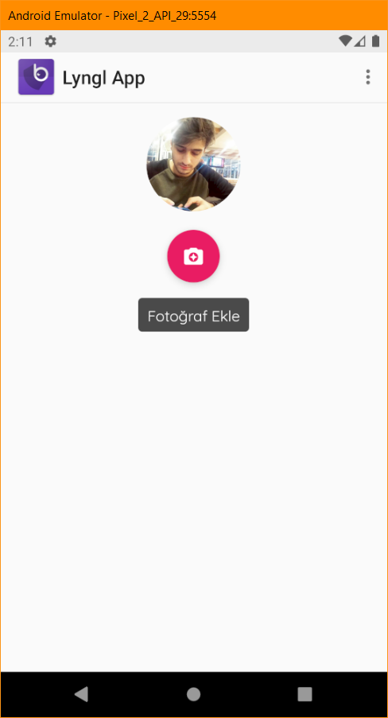

FloatingTextButton
========
FloatingTextButton Android için geliştirdiğim zengin bir floating action button yapısıdır.<br/>


FloatingTextButton...

 * Animasyon özelliği
    * basit bir şekilde animasyon ile verdiğiniz yazıyı zıplatabilirsiniz
 * Arkaplan ve ripple renkleri
    * özünde olduğu gibi yine app taglarını xml dosyanızda kullanarak ripple ve background color belirtebilirsiniz
 * Resim değiştirme
    * özünde olduğu gibi yine app taglarını kullanarak xml dosyanızda istediğiniz resim dosyasını src olarak belirtebilirsiniz
 * Text'e click event ayarlama
    * eğer isterseniz yine app taglarını kullanarak xml dosyanızda verdiğiniz text'e click listener belirtebilirsiniz
-------------------

Tek adımda FloatingTextButton kullanımı:

## XML

```xml
<tr.com.emrememis.lynglapp.Views.FloatingTextButton
        android:id="@+id/floatingTextButton"
        android:layout_width="wrap_content"
        android:layout_height="wrap_content"
        android:layout_gravity="center_horizontal"
        app:label="Fotoğraf Ekle"
        app:src="@drawable/ic_camera_enhance_white_24dp"
        app:textClickable="true"
        app:animation="true"
        app:btnColor="#9C27B0"
        app:btnRippleColor="#FFFFFF"/>
```
## Params

| Value | Layout ID |
| :------: | :------: |
| app:src | @drawable/your_image |
| app:label | @string/your_text |
| app:animation | true |
| app:btnColor | @color/your_color |
| app:rippleColor | @color/your_color |
| app:textClickable | true |

-------------------

MainActivity'de yapmanız gerekenler

## Java

```java  
    FloatingTextButton floatingTextButton = findViewById(R.id.floatingTextButton);
    floatingTextButton.setCallback(new FloatingTextButton.FloatingTextButtonClickListener() {
            @Override
            public void clicked(@Nullable View view) {
                Log.d(TAG,"clicked");
            }
        });
    
    
    ```


